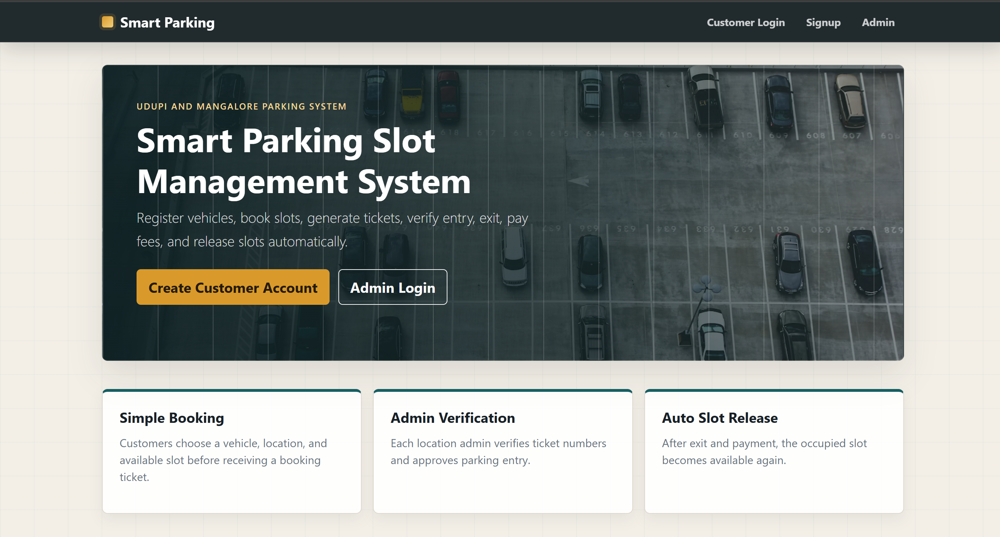
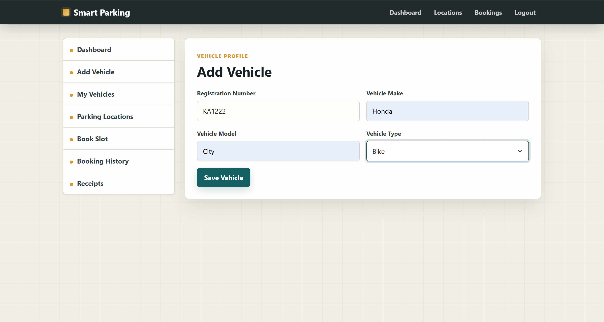
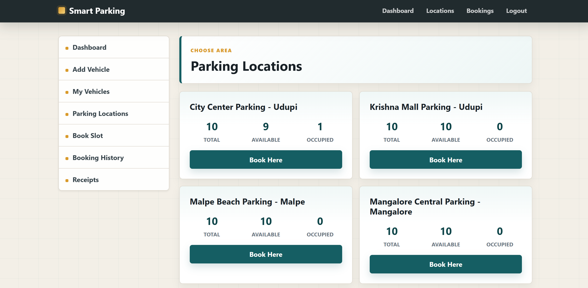
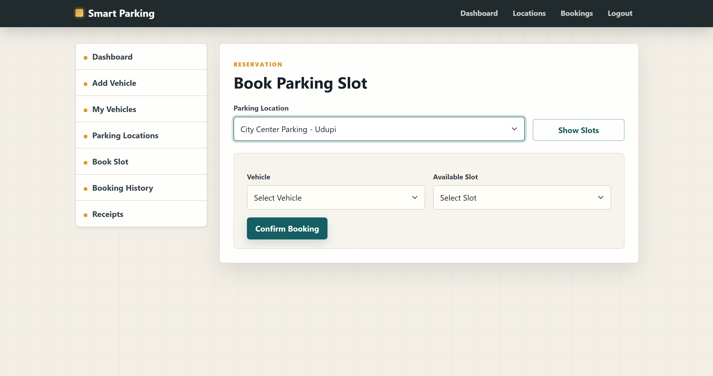
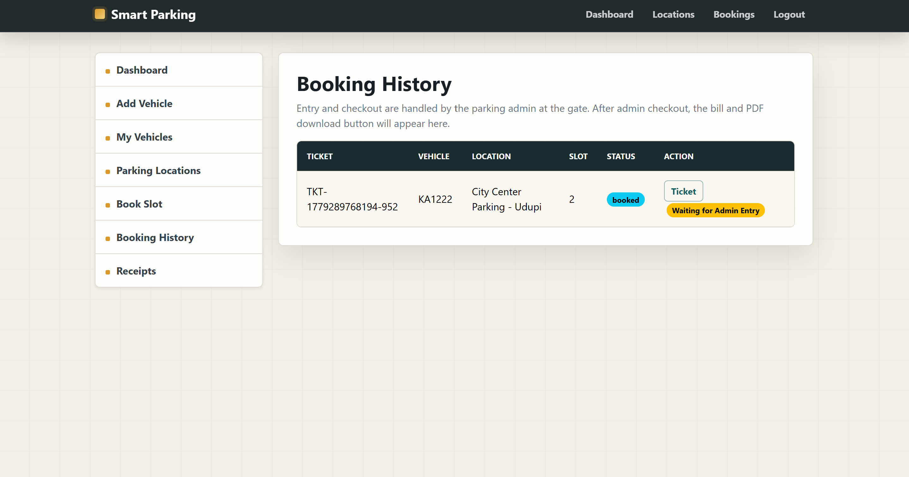
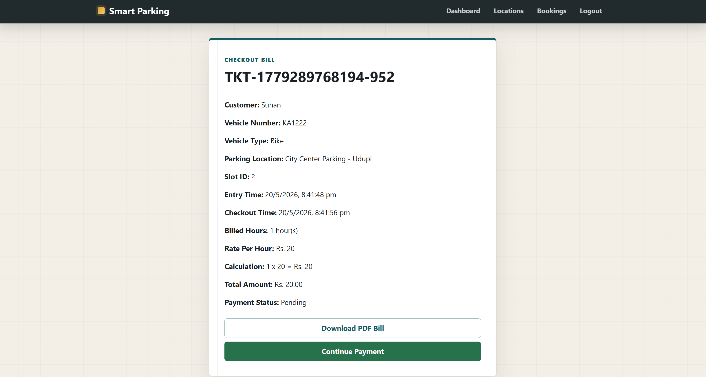
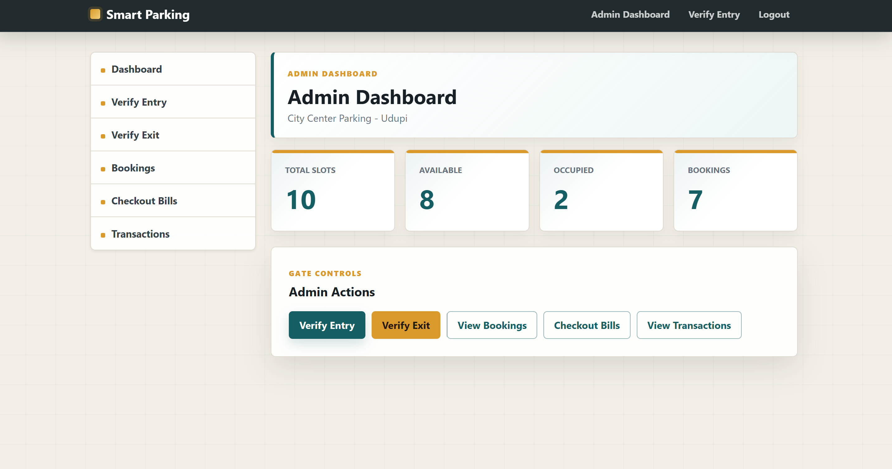

# Parking Slot Management System

A smart parking slot management web application built with Node.js, Express, MySQL, and EJS. It helps users book parking slots, manage vehicles, make payments, and view booking history, while admins can manage parking locations, bookings, bills, and transactions.

## Features

- User registration and login
- Admin login and dashboard
- Vehicle management
- Parking location and slot booking
- Booking history and ticket generation
- Payment and receipt management
- Admin booking, billing, and transaction management

## Screenshots

### Home Page



### Customer Screens

#### Add Vehicle



#### Parking Locations



#### Book Parking Slot



#### Booking History



#### Checkout Bill



### Admin Dashboard



## Tech Stack

- Node.js
- Express.js
- MySQL
- EJS
- HTML, CSS, JavaScript

## Installation

1. Clone the repository:

```bash
git clone <repository-url>
```

2. Open the project folder:

```bash
cd Parking_Slot_Management_System
```

3. Install dependencies:

```bash
npm install
```

4. Create a `.env` file and add your database details:

```env
DB_HOST=localhost
DB_PORT=3306
DB_USER=root
DB_PASSWORD=your_password
DB_NAME=parking
DB_SSL=false
AUTO_SETUP_DB=true
SESSION_SECRET=your_secret_key
PORT=3000
```

5. Set up the database:

```bash
npm run setup-db
```

6. Start the project:

```bash
npm start
```

For development mode:

```bash
npm run dev
```

## Available Scripts

- `npm start` - starts the application
- `npm run dev` - starts the application with nodemon
- `npm run setup-db` - creates and sets up the database
- `npm run check-db` - checks the database connection
- `npm run reset-admins` - resets admin data

## Deployment Notes

Do not use `DB_HOST=localhost` on a deployed website unless MySQL is installed on the same deployed server. Most hosting platforms run your Node.js app separately from the database, so `localhost` will fail with a MySQL connection error.

For deployment:

1. Create a hosted MySQL database using your hosting provider or a service such as Railway, Aiven, PlanetScale, Clever Cloud, or another MySQL-compatible provider.
2. Add these environment variables in your deployment dashboard:

```env
NODE_ENV=production
DB_HOST=your-hosted-mysql-hostname
DB_PORT=3306
DB_USER=your_database_user
DB_PASSWORD=your_database_password
DB_NAME=parking
DB_SSL=false
AUTO_SETUP_DB=true
SESSION_SECRET=use_a_long_random_secret
```

If your database provider requires SSL, set `DB_SSL=true`. If it provides a self-signed certificate and the connection fails because of certificate validation, set `DB_SSL=allow-invalid`.

When `AUTO_SETUP_DB=true`, the app creates missing tables and default parking/admin data automatically on startup without deleting customer, booking, vehicle, transaction, or receipt records.

Recommended deploy commands:

```bash
npm install
npm start
```

Before redeploying, verify the production database credentials locally by temporarily placing them in `.env` and running:

```bash
npm run check-db
```

## Project Structure

```text
config/        Database and authentication configuration
controllers/   Application logic
database/      Database setup and utility scripts
public/        Static CSS and JavaScript files
routes/        Application routes
views/         EJS view templates
index.js       Main server file
```
